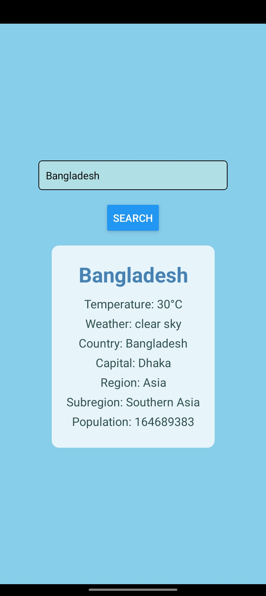

# React Native Weather and Country Info App

This project is a React Native application that displays weather information as well as country information. It utilizes two APIs, the React REST Countries API and the OpenWeatherMap API.

## Installation

To run this project locally, follow these steps:

1. Clone the repository to your local machine.
2. Run `npm install` or `yarn install` to install the necessary dependencies.
3. Create an account on the OpenWeatherMap website to obtain an API key.
4. Set up the OpenWeatherMap API key in the appropriate file (e.g., `config.js` or `constants.js`).
5. Run the project using the appropriate React Native commands for your desired platform (iOS/Android).

## APIs Used

1. [OpenWeatherMap API](https://openweathermap.org/api) - Provides weather data for the application.
2. [React REST Countries API](https://restcountries.com) - Provides country information for the application.

## Usage

Upon launching the application, users can view weather information for a specific location and access details about various countries. The application provides an intuitive interface for easy navigation and a seamless user experience.

## Screenshots

Include screenshots of the application to provide an overview of the user interface. 

## Example

Here is an example of how to use the application:

1. Open the application on your mobile device.
2. Allow the application to access your location or enter a specific location to view its weather information.
3. Navigate to the country information section to explore various details about different countries.

## Contributing

Pull requests are welcome. For major changes, please open an issue first to discuss what you would like to change.

Please make sure to update tests as appropriate.

## Contact

If you have any questions or suggestions, feel free to contact me at [robinibnnur@gmail.com].

## Download

You can download the app from => [Google Drive](https://drive.google.com/file/d/1a4fPPdFKvmohV_j42gLYShHtyvfNGBrU/view?usp=sharing)

## QR Code

Scan the QR code to download the app directly on your mobile device.

